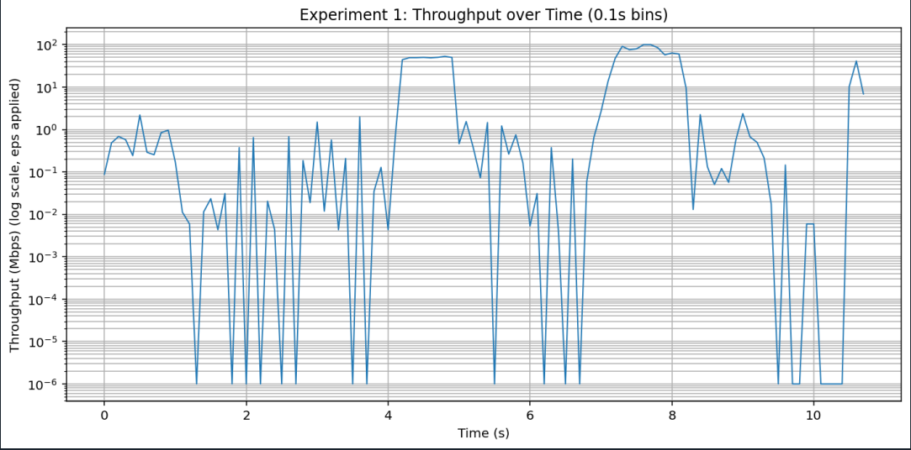
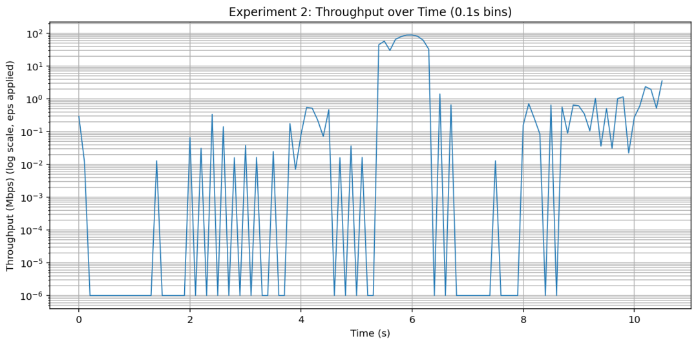

# wifi-throughput-speed-analyzer
- 패킷 단위 트래픽 분석을 통해 Wi-Fi 네트워크의 실제 처리량과 안정성을 시간대별로 비교·평가하는 시스템

## Overview
- 주변에서 접할 수 있는 여러 Wi-Fi 네트워크 중, 동일한 시간 동안 더 많은 데이터를 처리할 수 있는 Wi-Fi가 무엇인지 분석하고 이를 그래프로 시각화한다.
- 또한 각 Wi-Fi 네트워크가 초, 분, 시간 단위로 평균적으로 어느 정도의 데이터 처리량을 보이는지를 함께 제공하여 보다 직관적인 비교를 가능하게 한다.

## Motivation
- 많은 사용자들이 Wi-Fi 선택 시 신호 세기를 기준으로 판단하는 경우가 많다. 하지만 실제 전송 속도는 네트워크 혼잡도, 라우터 성능, 접속 기기 수 등에 따라 크게 달라지므로 신호 세기만으로 성능을 판단하기에는 한계가 있다.
- 본 프로젝트는 이러한 한계를 보완하기 위해, 실제 네트워크 트래픽에서 측정한 처리량을 기반으로 Wi-Fi 성능을 분석하고자 한다.

## Speed Definition
- 네트워크 통신에서 속도는 여러 방식으로 정의될 수 있지만, 본 프로젝트에서의 속도(speed)는 동일한 시간 동안 실제로 처리된 데이터의 양을 의미한다.
- Wi-Fi를 사용하는 대부분의 상황은 특정 작업을 수행하는 데 초점이 맞춰져 있으며, 이 과정에서 단위 시간당 처리 가능한 데이터 양이 체감 성능을 가장 직관적으로 반영한다고 판단하였다.

## Throughput Definition
- 이 프로젝트에서 처리량(Throughput)은 측정 시간 Δt 동안 무선 구간을 통해 실제로 전송된 데이터 프레임의 총량을 기반으로 정의한다.

$$
T_{\text{obs}} = ( Σ frame.len × 8 ) / ( Δt × 10^6 )
$$

- 여기서 frame.len은 각 프레임의 전체 길이(Byte)를 의미하며, MAC 헤더 및 상위 계층 헤더를 모두 포함한다.

## Measurement Pipeline
1. tshark / Wireshark를 이용해 특정 인터페이스 또는 필터 조건에서 패킷 캡처 시작
2. 일정 시간(예: 10초) 동안 캡처 후 PCAP 파일로 저장
3. PCAP 파일에서 프레임 길이(frame.len)의 합과 측정 시작·종료 시간을 계산
4. 처리량을 기반으로 전송 속도(Mbps) 계산 및 결과 저장

## Experimental Setup
- 기기: 개인 노트북 (모든 실험에서 같은 기기 사용)
- 운영 체제: Windows
- 캡처 도구: Wireshark / tshark
- Traffic type: YouTube 1080p video streaming
- Measurement method:
  - PCAP-based analysis
  - Throughput calculated using Σ frame.len over Δt
- 환경: Home Wi-Fi environment

## Outputs
- 평균 처리량(Observed Throughput) 계산 결과
- 시간 단위별 처리량 시각화 
- Wi-Fi 네트워크 간 처리량 비교 

## Experiment 1 Environment: YouTube 1080p streaming (Near AP)
- Wi-Fi AP: iptime_ws (AP #1)
- AP location: Same room (near distance)
- Measurement duration: ~10 seconds

## Experiment 1: YouTube 1080p streaming (Near AP)
- PCAP: C:\Users\nanev\Documents\exp1_wifi_test_10s.pcapng
- Parsed lines: 14364 | Skipped lines: 0
- Total bytes transmitted (Σ frame.len): 15829063 bytes
- Measurement duration (Δt): 10.715 seconds
- Observed throughput (T_obs): 11.818 Mbps

## Experiment 1 Result

- Observed throughput over time (0.1s bins, log scale):
 
  
## Experiment 2 Environment: YouTube 1080p streaming (Far AP)
- Wi-Fi AP: U+Net0861 (AP #2)
- AP location: Living room (farther distance)
- Measurement duration: ~10 seconds

## Experiment 2: YouTube 1080p streaming (Far AP)
- PCAP: C:\Users\nanev\Documents\exp2_wifi_test_10s.pcapng
- Parsed lines: 7193 | Skipped lines: 0
- Total bytes transmitted (Σ frame.len): 8109291 bytes
- Measurement duration (Δt): 10.595 seconds
- Observed throughput (T_obs): 6.123 Mbps

## Experiment2 Result
- Observed throughput over time (0.1s bins, log scale):
  

## Experiment 1 vs Experiment 2 Comparison
- Experiment 1과 Experiment 2는 동일한 환경과 트래픽 조건에서 Wi-Fi Access Point(AP)와 단말 간의 거리만을 변화시켜 수행한 실험이다.
- Experiment 1에서는 AP가 단말과 동일한 공간에 위치하여 상대적으로 안정적이고 높은 처리량이 관찰되었으며, 시간에 따른 처리량 변동 또한 비교적 작게 나타났다.
- Experiment 2에서는 AP가 거실에 위치하여 단말과의 거리가 증가함에 따라 평균 처리량이 감소하고, 처리량의 시간적 변동성이 증가하는 경향을 보였다. 이는 거리 증가로 인한 무선 채널 품질 저하 및 재전송 증가의 영향으로 해석할 수 있다.
- 이 결과는 동일한 네트워크 환경에서도 AP와 단말 간의 상대적 위치 변화가 실제 체감 성능에 유의미한 영향을 미칠 수 있음을 보여준다.
  
## Limitations
- 무선 어댑터 및 운영체제에 따라 캡처 가능한 정보에 제약이 있을 수 있음  
- 현 버전에서는 처리량을 중심으로 분석하므로 Wi-Fi 신호 세기를 세부적으로 표현하는 데 한계가 있다.
- 처리량을 평균값으로 표기할 경우, 실제 체감 처리량과 차이가 발생할 수 있으며 순간적인 트래픽 혼잡 상황이 결과에 충분히 반영되지 않을 가능성이 있다.

## Future Work
- 다수의 기기가 동시에 접속한 환경에서의 처리량 변화 분석
- 기기 수 증가에 따른 Wi-Fi 성능 변화와 신호 세기 간의 관계 분석
